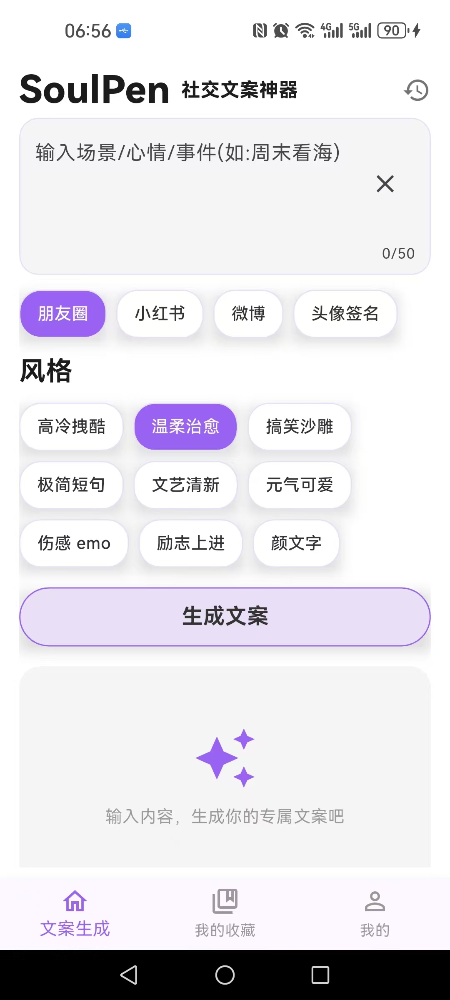
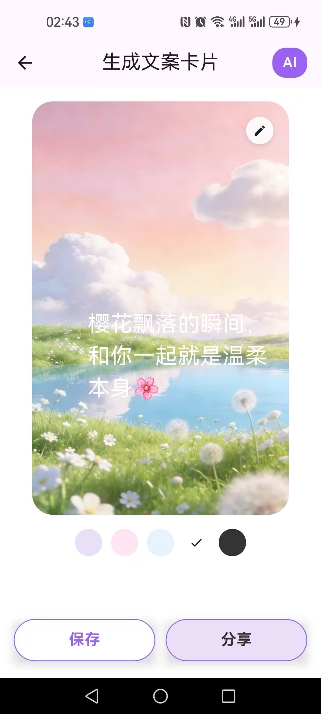
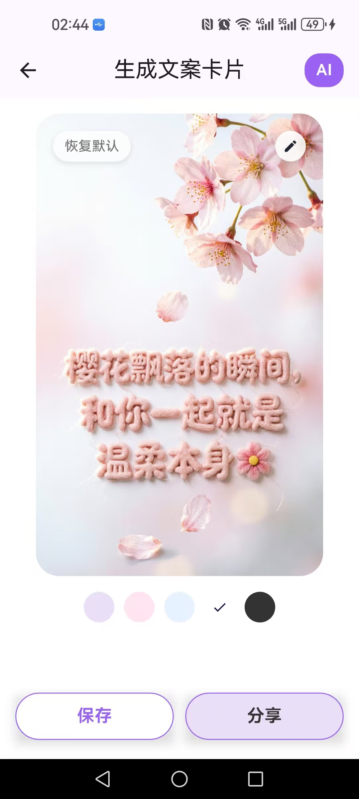
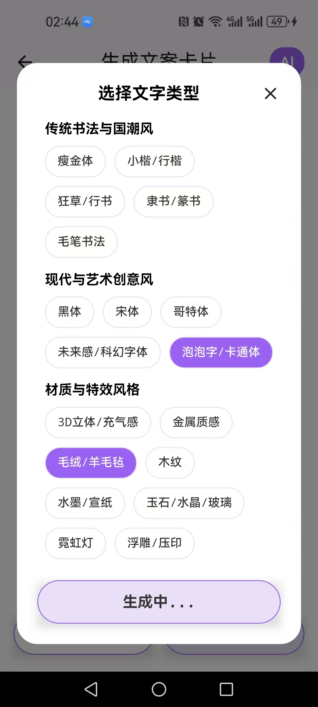
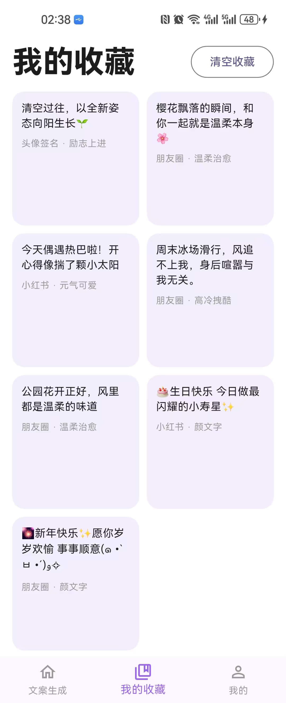
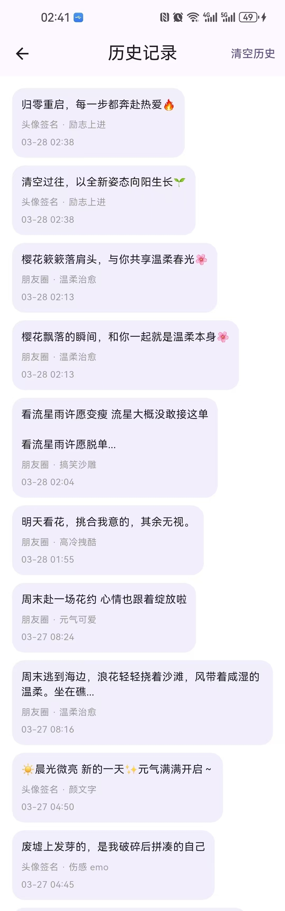
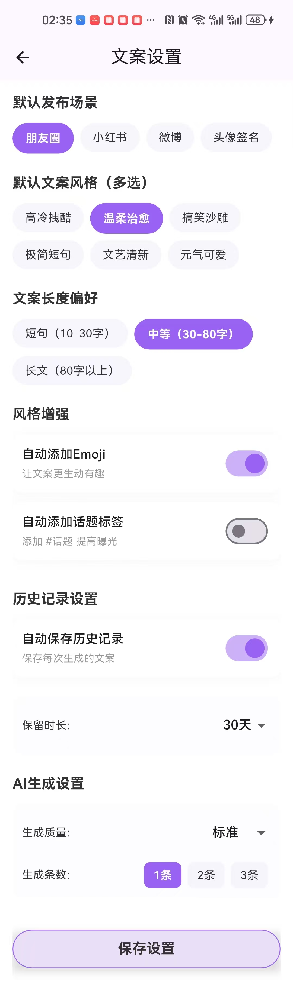

# flutter\_ai\_soulpen

⾯向18-35岁年轻⼈，主打「轻量、⾼效、⾼颜值」的社交⽂案⽣成⼯具。解决年轻⼈发朋友圈、⼩红书、微博、头像签名时“不会写、写不出特⾊、耗时久”的痛点。让年轻⼈10秒⽣成适配不同社交场景的专属⽂案，降低⽂案创作成本。

# AI模型介绍

项目主要接入了两种AI模型，分别是：

图像识别：豆包的 Doubao-Seed-1.6  （用于首页生成文案）

礼物推荐：千问的 Qwen-Image-2.0   （用于生成文案卡片）

# 所需AI模型的ApiKey的获取

## 一.豆包的apiKey和endpointId

🚀 第一步：注册并实名认证

1.访问官网：打开浏览器，访问火山引擎官网 (<https://www.volcengine.com/)。>

2.注册账号：点击右上角的“注册”按钮，使用手机号或邮箱完成账号注册。

3.实名认证：登录后，进入右上角的「账号管理」或「账号中心」，找到并完成 实名认证。

- 个人认证：上传身份证信息即可，通常审核很快。这是使用 API 服务的前提。

🔑 第二步：获取 API Key

1.进入火山方舟平台：在火山引擎控制台顶部搜索“火山方舟”，或直接访问其控制台页面。

2\.
创建密钥：在左侧导航栏中找到并点击 【**API Key 管理**】。

3.复制保存：点击“创建 API Key”，为其命名（如 my-doubao-app）。创建成功后，请立即复制并妥善保存 新生成的 API Key，因为关闭页面后将无法再次查看完整的密钥。

🧩 第三步：开通模型并创建接入点

1.创建推理接入点：在左侧菜单进入 【**在线推理**】页面，选择【**自定义推理接入点**】，点击【**创建推理接入点**】。

- 填写接入点名称和描述，如SoulPen，文案生成。
- +添加模型：选择Doubao-Seed-1.6。
- 其他配置保持默认即可，点击创建。

2.复制接入点ID：复制页面上显示的 **接入点ID** (Endpoint ID)，格式通常为 `ep-xxxxxxxxxxxxxx`。


## 二.千问的apiKey

1. 访问 [阿里云百炼/DashScope 控制台](https://bailian.console.aliyun.com/cn-beijing?spm=5176.28103460.0.0.38f97d83Yk6xiy\&tab=model#/api-key)。
2. 注册账号并完成实名认证。
3. 在【API-KEY管理】页面创建并复制你的 API Key（通常以 sk- 开头）。

# 项目运行

在 doubao\_api.dart中，填入apiKey和endpointId

在 qwen\_image\_api.dart中，填入apiKey

然后执行：

```
flutter pub get
flutter run
```

# 项目介绍

|  |  |  |  |
| :--: | :--: | :--: | :--: |
|生成文案|生成卡片|生成AI卡片|选择文案样式|


|  |  |  |
| :--: | :--: | :--: |
|我的收藏|历史记录|文案设置|

